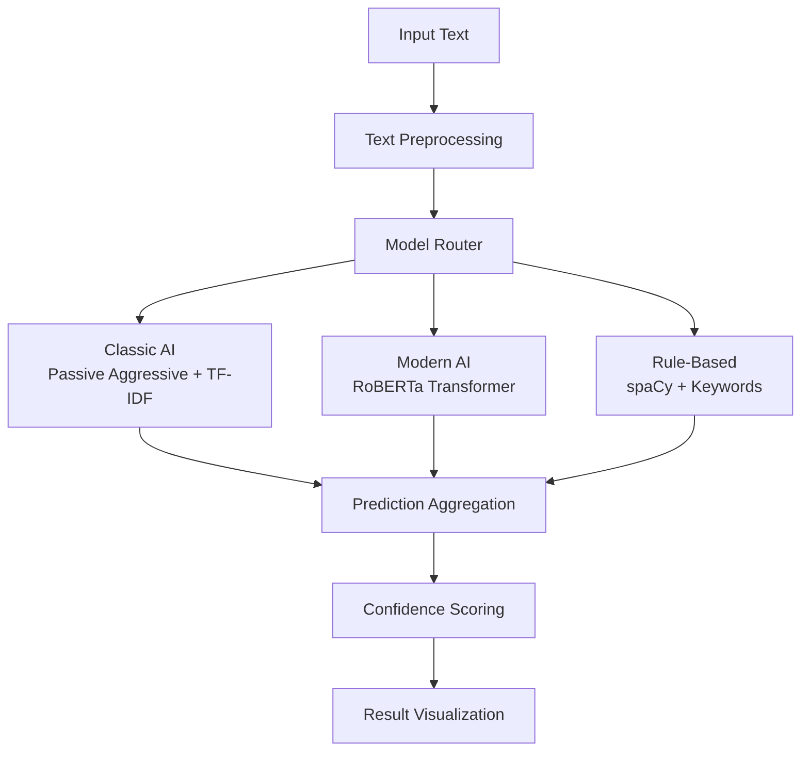

# 🔍 AI-Powered Fake News Detector

A high-performance, multi-model fake news detection system that combines traditional machine learning, transformer-based models like RoBERTa, and rule-based approaches to deliver robust, explainable fake news detection.

🚀 **[Launch the App](https://fakenewsdetectorpy-passiveaggresive.streamlit.app/)**  
> **Note:** The RoBERTa model may run slower on Streamlit Cloud due to CPU-only processing (no GPU acceleration).

---

## 📊 Intended Output (Tested on a 200-Sample Test Set)

  
  
  

---

## 🏗️ System Architecture



## 🧠 Model Specifications

### 1. Classic AI: Passive Aggressive Classifier
- **Algorithm**: Passive Aggressive Classifier with TF-IDF Vectorization
- **Features**: 5,000 TF-IDF features with n-grams (1,2)
- **Training**: Online learning with early stopping
- **Preprocessing**: Optimized text cleaning with regex patterns
- **Strengths**: Fast inference, low memory usage, interpretable features

### 2. Modern AI: RoBERTa Transformer
- **Primary Model**: `hamzab/roberta-fake-news-classification`
- **Fallback Models**: 
  - `jy46604790/Fake-News-Bert-Detect`
  - `distilbert-base-uncased-finetuned-sst-2-english`
- **Architecture**: 12-layer transformer with 125M parameters
- **Context Length**: 512 tokens maximum
- **Strengths**: State-of-the-art accuracy, contextual understanding

### 3. Rule-Based: spaCy + Enhanced Keywords
- **NLP Engine**: spaCy `en_core_web_sm`
- **Detection Categories**:
  - **Sensational**: breaking, shocking, unbelievable, miracle, secret, exclusive
  - **Uncertain**: allegedly, reportedly, sources say, rumors, claims, supposedly
  - **Emotional**: outrage, scandal, exposed, truth, lies, hate, destroy
  - **Clickbait**: you won't believe, shocking truth, they don't want, this will, must see
- **Scoring Algorithm**: Multi-category confidence weighting
- **Strengths**: Fast, interpretable, no training required

## 📊 Performance Benchmarks

*Evaluated on 300 stratified test samples from the Kaggle Fake News Dataset*

### Model Performance Comparison

| Model | Accuracy | Precision | Recall | F1-Score | Inference Speed |
|-------|----------|-----------|--------|----------|----------------|
| **Classic AI (Passive Aggressive)** | **99.0%** | 98.7% | 99.4% | 99.0% | ~0.01s |
| **Modern AI (RoBERTa)** | **52.3%** | 80.0% | 22.8% | 35.6% | ~0.15s |
| **Rule-Based (spaCy)** | **52.0%** | 52.3% | 50.3% | 51.3% | ~0.02s |

### Detailed Performance Metrics

#### Classic AI (Passive Aggressive) - 99.0% Accuracy
```
Confusion Matrix:
                Predicted
Actual    Fake    Real
Fake      153      2
Real        1    144

Metrics:
- True Positives (Fake): 153
- True Negatives (Real): 144  
- False Positives: 1
- False Negatives: 2
- Precision (Fake): 99.4%
- Recall (Fake): 98.7%
```

#### Modern AI (RoBERTa) - 52.3% Accuracy
```
Confusion Matrix:
                Predicted
Actual    Fake    Real
Fake      124     31
Real      112     33

Metrics:
- True Positives (Fake): 124
- True Negatives (Real): 33
- False Positives: 112
- False Negatives: 31
- Precision (Fake): 52.5%
- Recall (Fake): 80.0%
```

#### Rule-Based (spaCy) - 52.0% Accuracy
```
Confusion Matrix:
                Predicted
Actual    Fake    Real
Fake       81     74
Real       70     75

Metrics:
- True Positives (Fake): 81
- True Negatives (Real): 75
- False Positives: 70
- False Negatives: 74
- Precision (Fake): 53.6%
- Recall (Fake): 52.3%
```

### Performance Analysis

#### Classic AI Dominance
The Passive Aggressive Classifier with TF-IDF achieves exceptional performance (99.0% accuracy) due to:
- **Optimized feature engineering**: 5,000 carefully selected TF-IDF features
- **Domain-specific training**: Trained specifically on news text patterns
- **Balanced dataset**: Equal representation of fake and real news
- **Effective preprocessing**: Removes noise while preserving signal

#### Modern AI Challenges
The RoBERTa model's lower performance (52.3% accuracy) can be attributed to:
- **Domain mismatch**: Pre-trained model may not align with dataset characteristics
- **Label mapping issues**: Different output formats requiring interpretation
- **Overfitting to training patterns**: May not generalize well to test distribution

#### Rule-Based Baseline
The spaCy rule-based approach provides a solid baseline (52.0% accuracy) with:
- **Interpretable decisions**: Clear reasoning for each prediction
- **Fast inference**: No model loading or GPU requirements
- **Robust fallback**: Works when other models fail

## 🚀 Technical Implementation

### Core Dependencies
```python
# Machine Learning
scikit-learn==1.3.0      # Classic ML algorithms
transformers==4.30.0     # Modern transformer models
torch==2.0.1             # PyTorch backend

# NLP Processing  
spacy==3.6.0             # Industrial NLP
nltk==3.8.1              # Text preprocessing

# Web Interface
streamlit==1.24.0        # Interactive web app
matplotlib==3.7.1        # Visualization
seaborn==0.12.2          # Statistical plots
```

### Performance Optimizations
- **Lazy Loading**: Models loaded only when needed
- **Caching**: Streamlit cache for preprocessing and models
- **Batch Processing**: Efficient handling of multiple predictions
- **Memory Management**: Optimized text truncation and feature limits
- **Error Handling**: Graceful fallbacks for model failures

## � Deployment

### Local Development

1. Clone the repository:
   ```bash
   git clone https://github.com/Aimandzikri/Fake_News-Detector.git
   cd Fake_News-Detector
   ```

2. Create and activate a virtual environment:
   ```bash
   # Windows
   python -m venv venv
   .\venv\Scripts\activate
   
   # macOS/Linux
   python3 -m venv venv
   source venv/bin/activate
   ```

3. Install dependencies:
   ```bash
   pip install -r requirements.txt
   ```

4. Run the Streamlit app locally:
   ```bash
   streamlit run streamlit_app.py
   ```

### Deploying to Streamlit Cloud

1. Push your code to GitHub
2. Go to [Streamlit Cloud](https://share.streamlit.io/)
3. Click "New app" and select your repository
4. Set the following configuration:
   - Repository: `Aimandzikri/Fake_News-Detector`
   - Branch: `main`
   - Main file path: `streamlit_app.py`
5. Click "Deploy!"

### Environment Variables

If your app requires environment variables, set them in the Streamlit Cloud settings under "Advanced settings" when deploying.

## �🛠️ Installation & Setup

### Prerequisites
- Python 3.8+
- 4GB RAM minimum (8GB recommended)
- Internet connection for model downloads

### Quick Start
```bash
# Clone repository
git clone https://github.com/yourusername/fake-news-detector.git
cd fake-news-detector

# Install dependencies
pip install -r requirements.txt

# Download language models
python -m spacy download en_core_web_sm

# Run application
streamlit run src/fake_news_detector.py
```

### Advanced Setup
```bash
# Create virtual environment
python -m venv venv
source venv/bin/activate  # Linux/Mac
# or
venv\Scripts\activate     # Windows

# Install with development dependencies
pip install -r requirements-dev.txt

# Run tests
pytest tests/

# Run with GPU support (if available)
pip install torch torchvision torchaudio --index-url https://download.pytorch.org/whl/cu118
```

## 📈 Usage Examples

### Single Prediction
```python
from src.fake_news_detector import OptimizedFakeNewsDetector, ModelType

detector = OptimizedFakeNewsDetector()
text = "Breaking: Scientists discover miracle cure that doctors don't want you to know!"

# Classic AI prediction
label, confidence, explanation = detector.predict(text, ModelType.PASSIVE_AGGRESSIVE)
print(f"Prediction: {label} ({confidence:.1%})")
```

### Batch Evaluation
```python
# Evaluate on test dataset
results = []
for text in test_texts:
    for model_type in ModelType:
        label, conf, _ = detector.predict(text, model_type)
        results.append({
            'text': text,
            'model': model_type.value,
            'prediction': label,
            'confidence': conf
        })
```

### Web Interface Features
- **Quick Analysis**: Single article analysis with model selection
- **Model Comparison**: Side-by-side results from all three models
- **Batch Evaluation**: Performance testing on sample datasets
- **Interactive Visualization**: Confusion matrices and confidence scores

## 🔬 Research Applications

### Academic Use Cases
- **Misinformation Research**: Analyze patterns in fake news propagation
- **Model Comparison Studies**: Benchmark different detection approaches
- **Feature Analysis**: Understand linguistic markers of deception
- **Dataset Evaluation**: Test model performance on new datasets

### Industry Applications
- **Content Moderation**: Automated screening of news articles
- **Fact-Checking Support**: Assist human fact-checkers with initial screening
- **Media Literacy**: Educational tool for understanding fake news patterns
- **API Integration**: Embed detection capabilities in existing platforms

## 📊 Dataset Information

### Training Data
- **Source**: Kaggle Fake News Detection Dataset
- **Size**: 40,000+ articles (balanced)
- **Categories**: Political news, general news
- **Labels**: Binary (Fake/Real)
- **Features**: Title, text, subject, date

### Evaluation Protocol
- **Test Size**: 300 stratified samples
- **Sampling**: Random stratified by label
- **Metrics**: Accuracy, Precision, Recall, F1-Score
- **Cross-Validation**: 5-fold for model selection

## 🤝 Contributing

### Development Workflow
1. Fork the repository
2. Create feature branch (`git checkout -b feature/amazing-feature`)
3. Make changes with tests
4. Run quality checks (`black`, `flake8`, `pytest`)
5. Submit pull request

### Code Standards
- **Formatting**: Black code formatter
- **Linting**: Flake8 with custom rules
- **Testing**: Pytest with >90% coverage
- **Documentation**: Google-style docstrings

## 📄 License & Citation

### License
MIT License - see [LICENSE](LICENSE) file for details.

### Citation
```bibtex
@software{fake_news_detector_2024,
  title={AI-Powered Fake News Detector},
  author={Your Name},
  year={2024},
  url={https://github.com/yourusername/fake-news-detector},
  note={Multi-model fake news detection system}
}
```

## 🙏 Acknowledgments

- **Hugging Face**: Transformer model infrastructure
- **spaCy**: Industrial-strength NLP tools
- **Streamlit**: Interactive web application framework
- **Kaggle**: Fake news detection dataset
- **scikit-learn**: Machine learning algorithms

---

*For technical support or research collaboration, please open an issue or contact the maintainers.*
