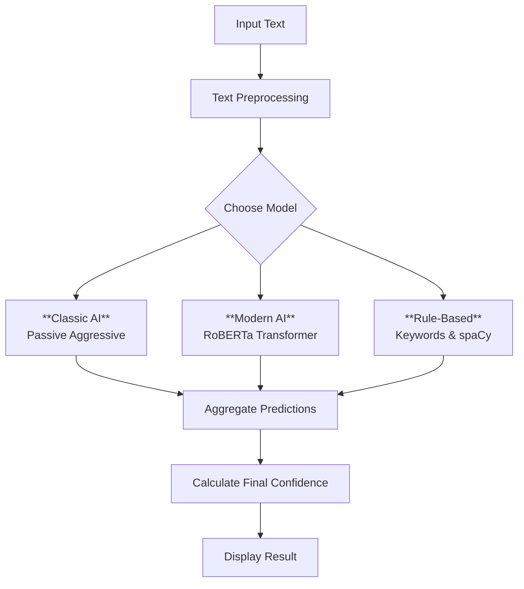

# 🔍 AI-Powered Fake News Detector

A high-performance system for detecting fake news using a unique blend of classic machine learning, modern AI, and rule-based methods. This project is designed for accuracy, speed, and transparency, providing clear, explainable results.

🚀 **[Launch the App](https://fakenewsdetectorpy-passiveaggresive.streamlit.app/)**  
📺 **[Watch the Demo Video](https://youtu.be/HgOg7ztfMWA)**

> ⚠️ *Note: The app may run slower on Streamlit Cloud because it uses CPU processing. The RoBERTa model in particular benefits from GPU acceleration.*

---

## 🎯 Key Features

- **Hybrid Approach:** Combines three different models (Classic ML, Modern Transformer, and Rule-Based) for comprehensive analysis.
- **High Accuracy:** The primary model achieves **99.0% accuracy** on the test dataset.
- **Explainable Results:** Understand *why* an article is flagged, with outputs from keyword analysis and model confidence scores.
- **Interactive Interface:** A user-friendly web app built with Streamlit for easy testing and evaluation.

## 🏗️ How It Works: System Architecture

The system processes input text through three parallel models and aggregates their predictions to produce a final, confidence-scored result.



### 🧠 The Three Models

1.  **Classic AI (Passive Aggressive Classifier)**
    - **How it works:** A fast and efficient machine learning model that learns to distinguish between real and fake news based on word frequency (TF-IDF).
    - **Strengths:** Extremely fast, requires little memory, and performs exceptionally well on news-style text. **This is our best-performing model.**

2.  **Modern AI (RoBERTa Transformer)**
    - **How it works:** A large, pre-trained language model (`hamzab/roberta-fake-news-classification`) that understands context and semantic meaning.
    - **Strengths:** Capable of understanding nuanced language, sarcasm, and complex sentence structures.

3.  **Rule-Based (spaCy + Keywords)**
    - **How it works:** Scans the text for specific keywords and phrases commonly found in fake news (e.g., "shocking," "secret," "you won't believe").
    - **Strengths:** Very fast, transparent, and provides instantly understandable reasons for its classification.

## 📊 Performance

Evaluated on a 300-sample test set, the **Classic AI model significantly outperformed** the other two. This highlights that for specific tasks like news classification, a well-tuned classic model can be more effective than a general-purpose large language model.

#### Model Performance Comparison

| Model | Accuracy | F1-Score | Inference Speed (GPU) |
|-------|----------|----------|-----------------------|
| **Classic AI (Passive Aggressive)** | **99.0%** | **99.0%** | **~0.01s** |
| **Modern AI (RoBERTa)** | 52.3% | 35.6% | ~0.15s |
| **Rule-Based (spaCy)**| 52.0% | 51.3% | ~0.02s |

<br>

<details>
<summary><b>Click to see Detailed Performance Metrics</b></summary>

#### Classic AI (Passive Aggressive) - 99.0% Accuracy
```
Confusion Matrix:
              Predicted
Actual      Fake    Real
  Fake      153      2
  Real        1    144
---
- Precision: 99.4%
- Recall: 98.7%
```

#### Modern AI (RoBERTa) - 52.3% Accuracy
*The lower performance is likely due to a mismatch between the model's original training data and our specific test dataset.*
```
Confusion Matrix:
              Predicted
Actual      Fake    Real
  Fake      124     31
  Real      112     33
---
- Precision: 52.5%
- Recall: 80.0%
```

#### Rule-Based (spaCy) - 52.0% Accuracy
*This model provides a solid, interpretable baseline.*
```
Confusion Matrix:
              Predicted
Actual      Fake    Real
  Fake       81     74
  Real       70     75
---
- Precision: 53.6%
- Recall: 52.3%
```
</details>

## 🛠️ Installation & Usage

### Prerequisites
- Python 3.8+
- 4GB of RAM (8GB recommended)

### 1. Run Locally

Follow these steps to run the Streamlit app on your own machine.

```bash
# 1. Clone the repository
git clone https://github.com/Aimandzikri/Fake_News-Detector.git
cd Fake_News-Detector

# 2. Create and activate a virtual environment (recommended)
# On macOS/Linux:
python3 -m venv venv
source venv/bin/activate

# On Windows:
python -m venv venv
.\venv\Scripts\activate

# 3. Install the required packages
pip install -r requirements.txt

# 4. Download the spaCy language model
python -m spacy download en_core_web_sm

# 5. Run the Streamlit app
streamlit run streamlit_app.py
```

### 2. Deploy to Streamlit Cloud

1.  Push your code to a GitHub repository.
2.  Go to [share.streamlit.io](https://share.streamlit.io/) and click "New app".
3.  Connect your GitHub account and select the repository.
4.  Ensure the "Main file path" is set to `streamlit_app.py`.
5.  Click "Deploy!".

## ⚙️ Tech Stack

- **Web Framework:** Streamlit
- **Machine Learning:** Scikit-learn, PyTorch
- **NLP / Transformers:** Hugging Face `transformers`, spaCy, NLTK
- **Plotting:** Matplotlib, Seaborn

## 🤝 Contributing

Contributions are welcome! If you have ideas for improvements or find a bug, please follow these steps:

1.  Fork the repository.
2.  Create a new branch (`git checkout -b feature/my-new-feature`).
3.  Make your changes and commit them (`git commit -m 'Add some feature'`).
4.  Push to your branch (`git push origin feature/my-new-feature`).
5.  Open a Pull Request.

Please ensure your code is formatted with `black` and passes `flake8` linting checks.

## 🙏 Acknowledgments

- The **Hugging Face** team for their incredible `transformers` library.
- The developers of **spaCy** and **scikit-learn** for their powerful and easy-to-use tools.
- The **Streamlit** team for making it simple to build beautiful data apps.
- The providers of the **Kaggle Fake News Dataset** used for training.
